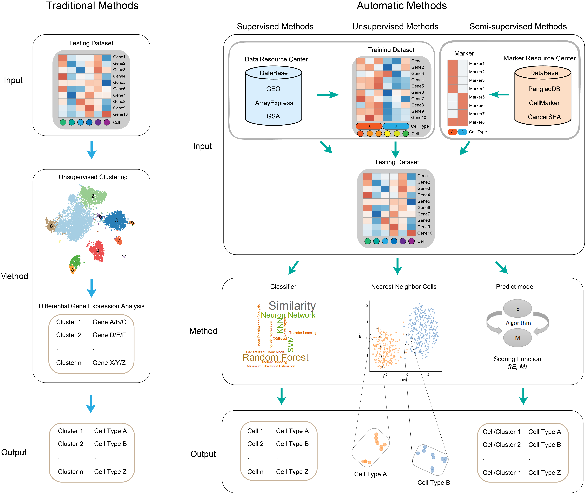

# AutomaticCellTypeIdentification

AutomaticCellTypeIdentification is a wrapper of published automatic cell type identification methods which contains supervised methods, unsupervised methods and semi-supervised methods.

<p align="center" width="100%">
     
</p>


## Installation

### Install from R

You can install AutomaticCellTypeIdentification from github with:

```R
devtools::install_github('xiebb123456/AutomaticCellTypeIdentification')
```
Note: AutomaticCellTypeIdentification is a wrapper of published methods, the needed package is in Description file.


### Install from docker
```docker
sudo docker pull registry.cn-hangzhou.aliyuncs.com/xiebb123456/automaticcelltypeidentification
```

## Running AutomaticCellTypeIdentification methods

Now, three interface of ```eagersupervised```, ```lazysupervised```, ```markersupervised``` methods supports the available automatic methods.  
```eagersupervised``` methods include ACTINN, CaSTLe, CHETAH, clustifyr, Garnett, Markercount, MARS, scClassifR, scHPL, SciBet, scID, scLearn, scmapcluster, scPred, scVI, Seurat, SingleCellNet and SingleR.  
```lazysupervised``` methods include CELLBLAST and scmapcell.  
```markersupervised``` methods include scTyper, Markercount, SCSA, DigitalCellSorter and SCINA.  

### Prepare input data  
The input of training and testing data is count matrix, the row is gene and the column is cell.

### Example with running supervised methods Seurat
```R
eagersupervised(train,test,label_train,method='Seurat')
```

### Example with running unsupervised methods CELLBLAST
```R
lazysupervised(train,test,label_train,method='CELLBLAST')
```

### Example with running supervised methods SCSA
```R
markersupervised(test,marker,method='SCSA')
```
Note: the conda environment of python-based method is needed to load at the beginning in R.

## Tutorial
For more details and basic usage see following tutorials:
[Guided Tutorial](vignettes/introduction.Rmd)

## Contact
Feel free to submit an issue or contact us at xiebb7@mail.sysu.edu.cn for problems about the package installation and usage.
